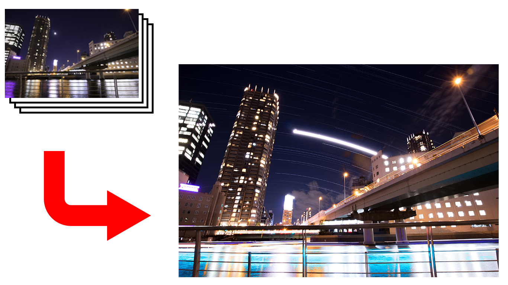

## 何をするためのもの？

数百枚の，同じ構図の夜景写真を合成して，１枚の星景写真を合成するアプリケーション．  
JPEG画像でこれを行うアプリケーションは既にあるが，非圧縮のTIFF画像で行うものは存在しなかったため，自ら作成した．

  

後に，その応用として，合成される様子をタイムラプス映像風にする機能も加えた．  
（映像用の画像フレームを作るだけ．映像として完成させるにはAdobe Premiere等を使用）  

<iframe width="560" height="315" src="https://www.youtube.com/embed/gG56KpCU9f4" frameborder="0" allow="accelerometer; autoplay; encrypted-media; gyroscope; picture-in-picture" allowfullscreen></iframe>

## どのように使う？
```
$ java main.Main (画像1のパス) (画像2のパス) ...
```

## どのようなアルゴリズムで実現した？
全ての画像データについて，各ピクセル毎に，輝度のmaxを取る．  

画像データ800枚の場合，データ容量の総計は 102MB * 800枚 = 81.6GB  
当然ながら一度に全てメモリに載せるのは不可能．  
（実際には，1600万画素の16bitTIFF画像1枚が unsinged short型 $1.6 \times 10^7$ 個に相当するので，2枚の画像を同時にメモリに載せて計算できるかもあやしい）  

実際の演算をピクセル毎に行っている点に注目し，画像1枚1枚を処理するのではなく，ピクセルを順に処理するようにすることでこれを解決した．

## License
ソフトウェア自体，及びその使用例として付属する画像データ全てを MIT License で公開．  
2018/12/01 Tetsuya Hori